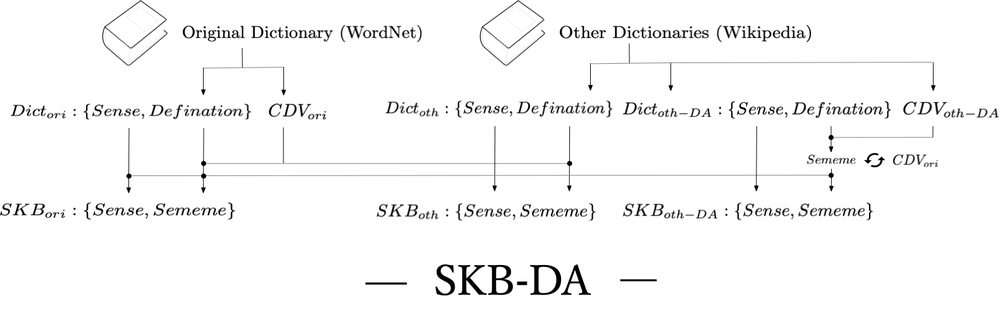

# SKB-DA
<p align="center">

This repository provides the source codes of "A Data Augmentation Method for Building Sememe Knowledge Base via Reconstructing Dictionary Definitions" published in The Association for Natural Language Processing 2022
## How to use your own data to construct SKB-AD
  
Get the words and definitions for Wikipedia and WordNet.
> First you need to process the Wikipedia file (please use the provided file)
> ```./wiki_processing/src/wiki-preprocessing.sh```

```
./SKB-DA/get_defination.py
```

Lemmatization for definitions
```
./SKB-DA/lemmatization.py
```

Please use TagMe Api to extract entity links. In the following link we provide the extraction results of 900,000 Wikipedia entries
* sentence index (37.4MB): https://drive.google.com/file/d/1s8FSzDF5WpOPysJKgMhEWOY3sjHR6fi-/view?usp=sharing
* sentence entity (6.24GB): https://drive.google.com/file/d/1-nbmF6evNipnU_ePcG0dYg126OD7GCJr/view?usp=sharing

Constructing the original SKB using WordNet
```
./SKB-DA/wordnet_sememe.ipynb
```
Using Wikipedia to build SKB
```
./SKB-DA/wiki_sememe.ipynb
```
Expansion of SKB
```
./SKB-DA/ad_processing.ipynb
```
  
## For Reproduce the results

### Table 2  Evaluate on Consistency Check of Sememe Annotations

```
./sememe_network_cdv_en_wiki_2000.npy
./sememe_network_cdv_en_wordnet_2000.npy
./sememe_network_cdv_en_wordnet_all_tagme_2000.npy

./sememe_network_dict_en_wiki_2000.npy
./sememe_network_dict_en_wordnet_2000.npy
./sememe_network_dict_en_wordnet_all_tagme_2000.npy
```

### Table 3  Evaluate on Sememe Graph 


WordNet&WikiSKB+ (1.4GB): 
https://drive.google.com/file/d/1Tp3aPvQvStcuL6CVh39-EZodp-4UA4wB/view?usp=sharing

WordNet&WikiSKB (1.37GB): 
https://drive.google.com/file/d/1awksEdxvb15zNkw3ecQTPNc9E7ZjZ8xi/view?usp=sharing
